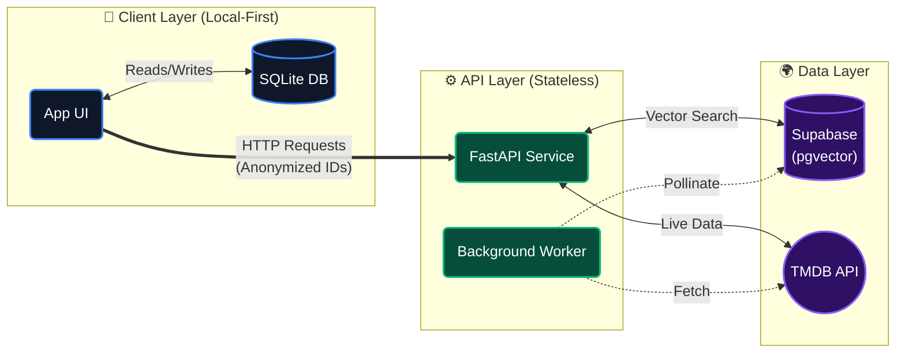
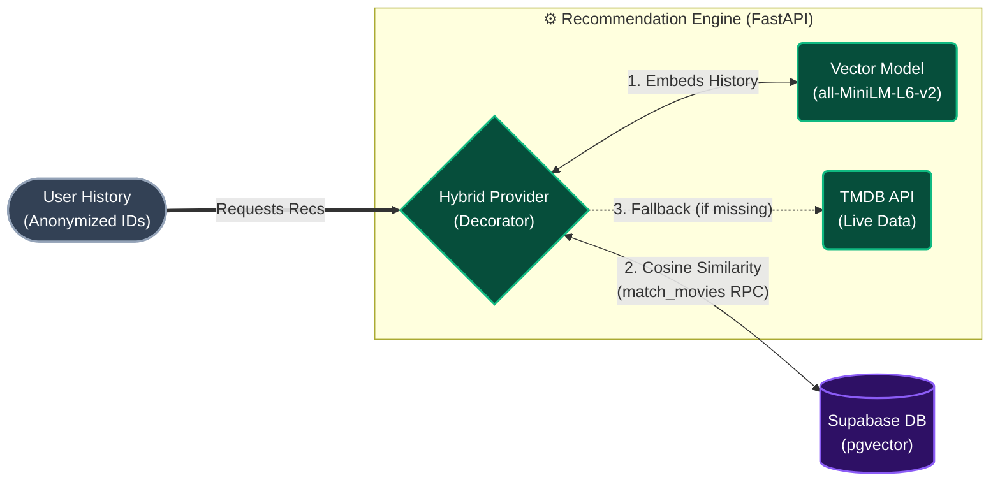

# OmniLog

OmniLog is a privacy-first, highly personalized mobile application for cataloging media (movies, television shows, and books). The system leverages a local-first architecture coupled with a stateless microservice to deliver intelligent, vector-based recommendations without compromising user privacy. All user state is strictly maintained on-device, with the backend functioning purely as a semantic computation engine.

## Feature Matrix

| Feature | Description | Architecture Benefit |
| :--- | :--- | :--- |
| **Local-First Storage** | All user logs, ratings, and preferences are stored exclusively on the device using SQLite. | Guarantees absolute data privacy and zero cloud lock-in. |
| **Offline High-Availability** | Integrates `@tanstack/react-query-persist-client` with `AsyncStorage` to cache API responses. | App remains fully functional in offline mode, serving cached recommendations. |
| **Hybrid Vector Recommendations** | Vibe Match Engine embeds highly-rated movies into a 384-dimensional vector space using `all-MiniLM-L6-v2`. | Enables deep semantic similarity search without tracking user profiles. |
| **Stateless Microservice** | The FastAPI backend retains zero session data; it only computes vectors from anonymized integer IDs. | Enforces privacy by design; backend is highly scalable and disposable. |
| **Autonomous Data Pollination** | Background worker (`SyncMoviesUseCase`) continuously ingests niche catalog data into the vector DB. | Ensures recommendations are diverse and discoverable without manual data entry. |

## System Architecture

The architecture is divided into a local-first mobile client and a stateless recommendation microservice.

### 1. High-Level Data Flow



### 2. Vibe Match Recommendation Engine

At the core of the backend is the `HybridMediaProvider`, which implements the Decorator pattern to seamlessly blend live TMDB data with our custom Vector database.



## Technical Layers Breakdown

### Mobile Client (React Native & Expo)
- **Framework:** React Native managed via Expo.
- **Persistence:** Local `expo-sqlite` (modern synchronous API) for core relational data, supplemented by `AsyncStorage` for query caching.
- **Network & State:** `@tanstack/react-query-persist-client` handles server-state synchronization and offline caching mechanics.
- **Styling:** Custom StyleSheet logic implementing a dark-mode glassmorphism design language using `expo-blur`. Third-party utility classes (e.g., Tailwind) are strictly prohibited to enforce a unified design system.
- **Iconography:** `lucide-react-native`.

### Deep Catalog Backend (FastAPI + Supabase)
- **Framework:** Python 3.12+ with FastAPI.
- **Hybrid Data Retrieval (Decorator Pattern):** 
  - **Live Fallback (`RealTMDBProvider`):** Direct TMDB connection for fetching high-volatility data (upcoming releases). Cached via `diskcache` for microsecond latency.
  - **Vector DB (`SupabaseMediaProvider`):** Decorator wrapping the TMDB provider. Utilizes Supabase `pgvector` for scalable cosine similarity searches against embedded metadata.
- **Embedding Engine:** Implements `SentenceTransformer` with the `all-MiniLM-L6-v2` model to map textual metadata into 384-dimensional vector space.

## Data/Schema Design

### Local Persistence Layer (SQLite)

| Entity | Primary Attributes | Purpose |
| :--- | :--- | :--- |
| **MediaItems** | ID, Title, Type, Poster URI, Release Year, Runtime, Directors/Authors | Core metadata caching for instant offline rendering. |
| **UserReactions** | Media ID, Rating Weight | A 4-tier rating system mapped to numeric weights: `lame` (-2.0), `okay` (0.0), `freaking` (1.0), `Absolute cinema` (2.0). Used as the input vector for recommendations. |

### Remote Vector Layer (Supabase pgvector)

| Entity | Core Schema | Purpose |
| :--- | :--- | :--- |
| **Movies/Media** | ID, Metadata Text, `embedding` (vector(384)) | Stores the semantic representation of media for `match_movies` RPC cosine similarity calculations. |

## Local Setup & Development

### Prerequisites
- Node.js (v18+)
- Python (3.12+)
- Expo CLI
- iOS Simulator or Android Emulator

### Mobile Client Environment
```bash
cd mobile
npm install
npx expo start
```

### Backend Microservice Environment
```bash
cd backend
python3 -m venv venv
source venv/bin/activate
pip install -r requirements.txt
uvicorn main:app --reload
```

## Development Principles

1. **No Cloud Storage:** User state and behavioral data must never leave the device. Network payloads are restricted to anonymous integer arrays representing entity IDs.
2. **Stateless Operations:** The backend must rely entirely on payload parameters and internal ephemeral caches. No session state or user-level persistence is permitted.
3. **Strict Theming:** The application architecture supports dark mode exclusively, mandating a premium, highly-customized aesthetic without reliance on utility CSS frameworks.
